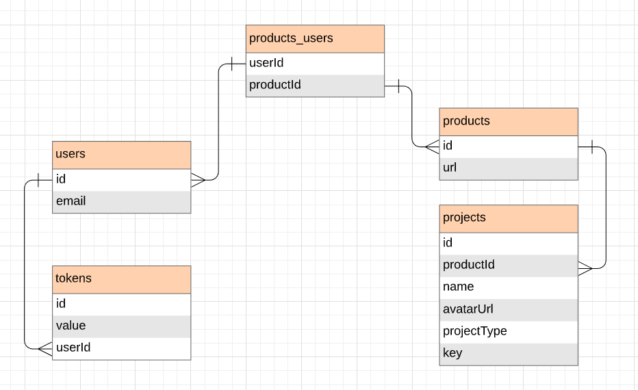

# Jira-integration-api

AVAILABLE ENDPOINTS

| method             | resource         | description                                                                                    |
|:-------------------|:-----------------|:-----------------------------------------------------------------------------------------------|
| `GET`              | `/`              | Simple welcome response                                                                        |
| `GET`              | `/api-docs`      | Swagger documentation                                                                          |    
| `POST`             | `/api/v1/projects`  | Jira projects                                                                          |    

# Getting Started
- Clone the repository
```
https://github.com/VladKachenya/tp-jira-integration-api.git
```

- Install dependencies
```
cd {project_name}
npm install
```

- Run the project directly in TS
```
npm run dev
```

- Build and run the project in JS
```
npm run build
npm run start
```

- Run tests in the project
```
npm run test
```

## Database - ORM
This API work with an PostgreSQL database, using [TypeORM](https://github.com/typeorm/typeorm). The database have the follow structure:


 
## Project Structure
TypeScript (`.ts`) files live in your `src` folder and after compilation are output as JavaScript (`.js`) in the `dist` folder.

The full folder structure of this app is explained below:

| Name | Description |
| ------------------------ | --------------------------------------------------------------------------------------------- |
| **dist**                 | Contains the distributable (or output) from your TypeScript build. This is the code you ship  |
| **node_modules**         | Contains all npm dependencies                                                            |
| **src**                  | Contains your source code that will be compiled to the dist dir                               |
| **src/test**             | Contains all test files
| index.ts                 | Entry point to app                                                                   |
| package.json             | File that contains npm dependencies as well as build scripts                                  |
| tsconfig.json            | Config settings for compiling server code written in TypeScript                               |
| ormconfig.env              | Env variables for creating migrations by TypeORM                                              |

## Running the build
| Npm Script | Description |
| ------------------------- | ------------------------------------------------------------------------------------------------- |
| `build`                   | Compiles all source `.ts` files to `.js` files in the `dist` folder                    |
| `dev`                     | Nodemon, process restarts if crashes. Continuously watches `.ts` files and re-compiles to `.js`   |
| `test`                    | Runs all tests in the project    |
| `start`                   | Runs node on `dist/index.js` which is the apps entry point                                |
| `typeorm`                  | Runs TypeORM commands | 

# Docker
This project using docker-compose for running PostgreSQL and node containers.

## run docker-compose
For running docker-compose needs:
1. Open "Docker Quickstart Terminal"
2. Go to project folder:
```
cd {project folder}/tp-jira-integration-api
```
3. Run docker-compose command
```
docker-compose up --build -d 
```


# Dependencies
Dependencies are managed through `package.json`.
To install or update these dependencies needs use `npm install` or `npm update`.
